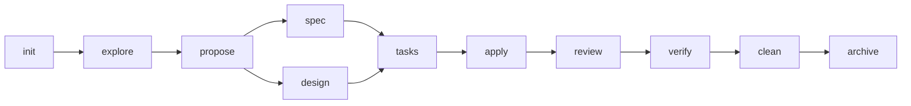

# SDD Workflow

**Spec-Driven Development for Claude Code — structured AI coding that doesn't forget, doesn't hallucinate, and doesn't skip steps.**


---

## Install

```bash
curl -sSL https://raw.githubusercontent.com/rechedev9/sdd-workflow/master/install.sh | bash
```

Or clone and run locally:

```bash
git clone https://github.com/rechedev9/sdd-workflow
cd sdd-workflow && ./install.sh
```

Then open any project and run:

```
/sdd:init
```

---

## Table of Contents

- [The Problem](#the-problem)
- [The Solution](#the-solution)
- [How It Works](#how-it-works)
- [The Four Pillars](#the-four-pillars)
- [What's New in v1.1](#whats-new-in-v11)
- [Quick Start](#quick-start)
- [Before and After](#before-and-after)
- [The Ecosystem at a Glance](#the-ecosystem-at-a-glance)
- [SDD Commands Reference](#sdd-commands-reference)
- [Documentation Index](#documentation-index)
- [Project Structure](#project-structure)
- [When NOT to Use SDD](#when-not-to-use-sdd)
- [Contributing](#contributing)
- [License](#license)

---

## The Problem

AI coding tools have changed how we build software. You can describe a feature in plain
English, and a model will generate working code in seconds. But anyone who has used these
tools on a real codebase — not a toy example, not a greenfield script, but a production
system with dozens of modules, established conventions, and accumulated technical
decisions — knows the pattern: it works brilliantly for the first few prompts, then starts
falling apart.

The root cause is architectural. Current AI coding workflows load an entire project into
a single agent context, ask it to understand everything at once, and hope it produces
coherent output. As the context window fills, the model begins compressing earlier
information. Decisions made three prompts ago get summarized into oblivion. Framework
version details blur together. The agent starts hallucinating file paths, inventing API
signatures, and suggesting patterns that conflict with the ones already established in
the codebase. When the context window resets — whether through compaction or a new
session — everything learned is gone.

This is not a model intelligence problem. The same model that produces incoherent output
in a polluted context will produce excellent output when given a clean context with
focused instructions and the right reference material. The problem is workflow
architecture: how we structure the interaction between the human, the model, and the
codebase. SDD is designed to fix that architecture.

---

## The Solution

SDD treats AI coding like an assembly line, not a one-person shop. Instead of one agent
doing everything — reading code, writing specs, designing architecture, implementing
features, reviewing its own work — SDD breaks the process into 11 discrete phases. Each
phase is handled by a fresh sub-agent that receives only the context it needs: a focused
SKILL.md instruction file, the relevant artifacts from prior phases, and nothing else.

The result is a pipeline where every phase produces a concrete artifact on disk, every
decision is traceable, and no single agent is asked to hold the entire project in its
head.



The orchestrator (your Claude Code session) manages the pipeline, launching sub-agents
for each phase and presenting results for human approval between steps. The human stays
in the loop for decisions. The AI handles the grunt work. Artifacts on disk replace
compressed context.

---

## How It Works

Each phase has a single responsibility, a defined input, and a concrete output artifact
stored in the `openspec/` directory.

| # | Phase | What Happens | Output Artifact |
|---|-------|-------------|-----------------|
| 1 | **init** | Bootstrap `openspec/` directory. Detect tech stack, frameworks, and conventions from the project. Generate configuration. | `openspec/config.yaml` |
| 2 | **explore** | Read-only codebase investigation. Map architecture, identify patterns, assess risks for the proposed change. | `openspec/changes/{name}/exploration.md` |
| 3 | **propose** | Write a human-readable change proposal. Define WHAT will change and WHY. Identify scope and impact. | `openspec/changes/{name}/proposal.md` |
| 4 | **spec** | Write delta specifications using RFC 2119 keywords (MUST/SHOULD/MAY). Define Given/When/Then scenarios for testable requirements. | `openspec/changes/{name}/specs/*/spec.md` |
| 5 | **design** | Write technical design: HOW the change will be implemented. Architecture decisions, interfaces, data flow, component boundaries. | `openspec/changes/{name}/design.md` |
| 6 | **tasks** | Break the design into phased, numbered implementation tasks. Each task is a concrete, verifiable unit of work. | `openspec/changes/{name}/tasks.md` |
| 7 | **apply** | Implement code in batches, one phase at a time. Built-in build-fix loop: implement, typecheck, fix, repeat. | Modified source files + updated `openspec/changes/{name}/tasks.md` |
| 8 | **review** | Semantic code review. Compare implementation against specs, design, and AGENTS.md rules. Flag violations. | `openspec/changes/{name}/review-report.md` |
| 9 | **verify** | Technical quality gate: typecheck, lint, tests, static analysis, security scan. Binary pass/fail with details. | `openspec/changes/{name}/verify-report.md` |
| 10 | **clean** | Dead code removal, duplicate elimination, simplification. Only touches code related to the change. | Modified source files + `openspec/changes/{name}/clean-report.md` |
| 11 | **archive** | Merge delta specs into main specs. Move change artifacts to archive. Capture learnings for future sessions. | `openspec/changes/archive/{date}-{name}/` |

### The Delta Spec Pattern

SDD uses delta specifications instead of full rewrites. Each spec describes only what
changes relative to the current state:

```markdown
# Example delta spec (in specs/*/spec.md)
deltas:
  - type: ADDED
    target: src/components/dashboard-chart.tsx
    description: New chart component for the analytics dashboard
    requirements:
      - "MUST accept a `data` prop of type `ChartDataPoint[]`"
      - "MUST render using the existing chart library (recharts)"
      - "SHOULD support responsive resizing"
      - "MAY support custom color themes"
    scenarios:
      - given: "A valid data array with 5 points"
        when: "The component renders"
        then: "5 data points are visible on the chart"

  - type: MODIFIED
    target: src/pages/dashboard.tsx
    description: Import and render the new chart component
    requirements:
      - "MUST import DashboardChart from components"
      - "MUST pass filtered data from the dashboard store"

  - type: REMOVED
    target: src/components/legacy-chart.tsx
    description: Remove deprecated chart component after migration
```

This approach means specs compose cleanly across changes, reviewers can see exactly what
is new versus modified, and archiving merges deltas into a coherent history.

---

## The Four Pillars

SDD is built on four interlocking systems. Each solves a specific failure mode of
standard AI coding workflows. Version 1.1 adds a fifth architectural concept —
**Semi-Formal Reasoning** — which forces agents to externalize their reasoning
process through structured hypothesis-evidence-observation cycles at critical
pipeline phases (explore, apply, review, verify). This prevents shallow analysis,
rubber-stamp reviews, and vague failure reports.

| Pillar | Problem It Solves | How It Works |
|--------|------------------|--------------|
| **Agent Teams Lite** | Context pollution — one agent tries to hold the entire project and loses coherence | The orchestrator delegates each phase to a fresh sub-agent via Claude Code's Task tool. Each sub-agent receives a clean context with only its SKILL.md and the relevant artifacts. No accumulated noise from prior phases. |
| **Engram Persistent Memory** | Session amnesia — decisions, patterns, and bug fixes are lost when context compacts or sessions restart | SQLite + FTS5 MCP memory system. Session start calls `mem_context` to load prior decisions. Proactive `mem_save` after every decision, bug fix, and pattern discovery. Memory survives compaction, session boundaries, and even machine restarts. |
| **Agent Review Rules** | No traceability — AI reviews its own code with no independent standard to check against | `AGENTS.md` contains machine-readable rules with RFC 2119-style prefixes (REJECT/REQUIRE/PREFER). The review sub-agent checks every rule mechanically, independent of the implementation sub-agent. |
| **Framework Skills** | Framework version mistakes — models mix patterns from different versions of the same library | Lazy-loaded SKILL.md files per framework. Triggered by file extension or import detection. Each skill contains version-specific patterns, banned APIs, and correct idioms for that exact version. |

### Agent Teams Lite — In Detail

The orchestrator never reads source code directly. It never writes implementation code.
Its only job is to track pipeline state, present summaries to the human, and launch
sub-agents with the right context.

```
Orchestrator (your session)
  |
  |-- Task(sdd-explore) → reads codebase, writes exploration.md
  |-- Task(sdd-propose) → reads exploration, writes proposal.md
  |-- Task(sdd-spec)    → reads proposal, writes specs/*/spec.md
  |-- Task(sdd-design)  → reads proposal, writes design.md
  |-- Task(sdd-tasks)   → reads spec + design, writes tasks.md
  |-- Task(sdd-apply)   → reads tasks + spec + design, writes code
  |-- Task(sdd-review)  → reads spec + design + code, writes review
  |-- Task(sdd-verify)  → runs typecheck/lint/test, writes report
  |-- Task(sdd-clean)   → reads code + review, simplifies
  |-- Task(sdd-archive) → merges specs, moves to archive
```

Each sub-agent starts with a clean context window. It reads its SKILL.md file first,
then the specific artifacts it needs. It never sees the accumulated conversation from
previous phases. This is why the same model produces better results in SDD — not because
it is smarter, but because it is less distracted.

### Engram Persistent Memory — In Detail

Engram is an MCP (Model Context Protocol) server backed by SQLite with FTS5 full-text
search. It provides tools that Claude Code can call:

| Tool | Purpose |
|------|---------|
| `mem_save` | Store a decision, pattern, bug fix, or discovery |
| `mem_search` | Search memory by keyword or topic |
| `mem_context` | Load relevant context for the current session |
| `mem_session_summary` | Save a structured session summary before closing |
| `mem_suggest_topic_key` | Get a canonical key for upsert (prevents duplicates) |
| `mem_update` | Update an existing memory entry |
| `mem_delete` | Remove an obsolete entry |
| `mem_timeline` | View chronological history of decisions |

The protocol is proactive: Claude saves memories immediately after decisions, not when
asked. Topic keys use families like `architecture/*`, `bug/*`, `decision/*`, and
`pattern/*` to organize entries and support upserts instead of duplicates.

### Agent Review Rules — In Detail

The AGENTS.md file contains rules with RFC 2119-inspired keyword prefixes:

```markdown
## Code Quality Rules

- REJECT: any use of `any` type in production code
- REJECT: empty catch blocks without logging
- REQUIRE: explicit return types on all exported functions
- REQUIRE: Result<T, E> pattern for fallible operations
- PREFER: async/await over .then() chains for multi-step flows
- PREFER: immutable patterns with local mutation exceptions
```

During the review phase, the sub-agent reads AGENTS.md and mechanically checks each rule
against the implementation. REJECT violations are hard failures. REQUIRE violations need
justification. PREFER violations are noted but not blocking. This creates a
machine-readable code standard that the AI enforces consistently.

### Framework Skills — In Detail

Framework skills are SKILL.md files loaded on demand when the code touches a specific
domain. They contain:

- Version-specific patterns and idioms
- Banned APIs and deprecated patterns
- Correct import paths and configuration
- Common pitfalls and how to avoid them
- Code examples for typical patterns

```
~/.claude/skills/frameworks/
  react-19/SKILL.md        # React 19 compiler, use(), Server Components
  tailwind-4/SKILL.md      # CSS-first config, @theme, no tailwind.config.js
  typescript/SKILL.md       # Strict mode patterns, type guards, Result<T,E>
  zod-4/SKILL.md            # Schema validation, v4 API changes
  zustand-5/SKILL.md        # v5 store patterns, middleware
  playwright/SKILL.md       # E2E testing patterns
  nextjs-15/SKILL.md        # App Router, Server Components, Server Actions
  ai-sdk-5/SKILL.md         # Vercel AI SDK integration
  github-pr/SKILL.md        # PR creation conventions
  django-drf/SKILL.md       # Django REST Framework patterns
  pytest/SKILL.md           # Python testing conventions
  jira-epic/SKILL.md        # Jira epic creation
  jira-task/SKILL.md        # Jira task creation
  skill-creator/SKILL.md    # Creating new SKILL.md files
```

Skills are triggered by file extension and import detection. Writing a `.tsx` file loads
the React 19 skill. Importing from `@tailwindcss` loads the Tailwind 4 skill. The
trigger table lives in CLAUDE.md and is checked before any framework-specific code
generation.

#### Self-Improving Protocol

Skills follow a feedback loop that makes them more complete over time:

1. **Before writing code**, read the relevant SKILL.md — it is the primary source of
   truth for that framework
2. **During implementation**, prefer SKILL.md over internet search. If the SKILL.md
   covers the topic, do not search the internet
3. **If the SKILL.md doesn't answer the question**, search the internet — then update
   the SKILL.md with the finding. Internet search during implementation signals an
   incomplete spec
4. **After implementation**, if new gotchas or patterns were discovered, append them to
   the SKILL.md

This protocol is inspired by [antirez's clean room methodology](https://antirez.com/latest/0):
curate documentation as a prerequisite, not a supplement. If the agent needs to search the
internet during implementation, the spec is incomplete — fix the spec, not just the code.
Over time, each SKILL.md converges toward completeness, and internet search during
implementation drops to zero.

#### Phase Delta Tracking

Every sub-agent returns a structured envelope. The orchestrator extracts a
`QualitySnapshot` from each envelope and appends it as a single JSON line to
`openspec/changes/{name}/quality-timeline.jsonl`. This creates a per-change
quality timeline that tracks build health, issue counts, completeness, and scope
across all 11 phases.

Planning phases (explore, propose, spec, design, tasks) produce mostly-null
snapshots — only `agentStatus` and completion counts are populated. Implementation
and verification phases populate build health (typecheck/lint/test results), issue
counts (critical/warning), and scope metrics (files created/modified/reviewed).

Run `/sdd:analytics` on a change to visualize trends: build health progression,
issue density by phase, completeness curves, and phase timing estimates. This is
especially useful for multi-session changes where quality drift is hard to spot
manually.

The tracking is observational and never blocking — if envelope extraction fails,
a minimal snapshot is written and the pipeline continues.

---

## What's New in v1.1

Version 1.1 introduces **Semi-Formal Reasoning** and **Research-Backed Optimizations** across the SDD pipeline. These enhancements are grounded in 2026 AI software engineering research and target specific failure modes observed in AI-assisted development.

### Semi-Formal Reasoning (4 enhancements)

AI agents tend to read files without purpose and review code without rigor. Semi-formal reasoning injects structured cognitive scaffolds that force agents to externalize their reasoning process.

| Phase | Enhancement | What it prevents |
|-------|-------------|-----------------|
| **explore** | Structured Exploration Protocol — HYPOTHESIS + CONFIDENCE + EVIDENCE → OBSERVATIONS → STATUS UPDATE → NEXT ACTION | Shallow exploration, confirmation bias, aimless file reading |
| **apply** | Structured Reading Protocol — lightweight hypothesis cycle before modifying files | Writing code that contradicts existing patterns |
| **review** | Semi-Formal Certificate — function tracing table, data flow analysis, counter-hypothesis check | Rubber-stamp reviews, missed data flow bugs |
| **verify** | Fault Localization Protocol — PREMISES (test semantics) + DIVERGENCE CLAIMS when tests fail | Vague "test failed" reports, guessing at root causes |

### Research-Backed Optimizations (4 enhancements)

| Enhancement | Phase | Research basis | What it solves |
|-------------|-------|---------------|----------------|
| **Test Generation Governance** | apply | "Rethinking Agent-Generated Tests" (Feb 2026) | Agents burning tokens on speculative tests that duplicate spec scenarios |
| **Experience-Driven Early Termination (EET)** | apply | EET framework (Jan 2026) | Build-fix loops stuck in known dead-end patterns, wasting tokens |
| **Dynamic Agentic Rubric** | review | Agentic Rubrics + LLM-as-Judge (2026) | Reviews anchored to generic best practices instead of change-specific requirements |
| **PARCER Operational Contracts** | init + orchestrator | PARCER governance framework (Mar 2026) | Phases launching without required inputs, inconsistent outputs |

### AGENTS.md Auto-Generation

`/sdd:init` now generates an `AGENTS.md` file when one doesn't exist. This file serves dual purpose:
- **AI code review rules** (REJECT/REQUIRE/PREFER) — extracted from your `CLAUDE.md` conventions
- **SDD global context** — so any AI agent (not just Claude Code) understands your project's SDD architecture, `openspec/` structure, and build commands

See [08-advanced.md](docs/08-advanced.md) for implementation details.

---

## Quick Start

### Prerequisites

- [Claude Code CLI](https://docs.anthropic.com/en/docs/claude-code) installed and
  authenticated
- Git initialized in your project
- (Optional) [Engram MCP](https://github.com/anthropics/engram) for persistent memory

### Installation

1. Copy the SDD skill files into your Claude Code configuration:

```bash
# Clone the SDD workflow repository
git clone https://github.com/anthropics/sdd-workflow.git

# Copy skills to your Claude Code config
cp -r sdd-workflow/skills/ ~/.claude/skills/

# Copy the commands
cp -r sdd-workflow/commands/ ~/.claude/commands/
```

2. Add the SDD orchestrator protocol to your project's `CLAUDE.md`:

```bash
# From your project root
cat sdd-workflow/claude-md-snippet.md >> CLAUDE.md
```

3. (Optional) Install Engram for persistent memory:

```bash
# Follow Engram installation instructions
# Then add to your Claude Code MCP config:
# ~/.claude/mcp.json
```

### First SDD Run

```bash
# Navigate to your project
cd your-project

# Start Claude Code
claude

# 1. Initialize SDD in your project (creates openspec/ directory)
/sdd:init

# 2. Start a new feature
/sdd:new add-user-dashboard "Add a dashboard page showing user analytics"

# This runs explore + propose automatically.
# Review the proposal. If it looks good:

# 3. Continue to the next phases
/sdd:continue add-user-dashboard
# Runs spec (writes requirements)

/sdd:continue add-user-dashboard
# Runs design (writes technical design)

/sdd:continue add-user-dashboard
# Runs tasks (writes implementation checklist)

/sdd:continue add-user-dashboard
# Runs apply (implements code, phase by phase)

/sdd:continue add-user-dashboard
# Runs review (checks code against specs)

/sdd:continue add-user-dashboard
# Runs verify (typecheck, lint, tests)

/sdd:continue add-user-dashboard
# Runs clean (removes dead code)

/sdd:continue add-user-dashboard
# Runs archive (merges specs, captures learnings)
```

### Fast-Forward Mode

If you want to skip straight to implementation, use `/sdd:ff` to fast-forward through
all planning phases at once:

```bash
# Fast-forward: runs explore → propose → spec → design → tasks in sequence
/sdd:ff add-user-dashboard "Add a dashboard page showing user analytics"

# Then apply
/sdd:apply add-user-dashboard

# Then review + verify + clean + archive
/sdd:continue add-user-dashboard
```

---

## Before and After

### Adding a Feature: Standard Workflow

```
1. Open Claude Code
2. "Hey, add a user dashboard with analytics charts"
3. Claude reads the entire codebase (fills context window)
4. Claude writes a bunch of files
5. You find type errors — ask Claude to fix them
6. Claude fixes types but breaks something else (context is polluted)
7. You notice it used React 18 patterns (wrong version)
8. You ask for a fix, Claude now has 50K tokens of conversation history
9. Context compacts — Claude forgets the type constraint from step 5
10. You start a new session and explain everything again
11. New session uses different naming conventions
12. Repeat steps 5-11 until exhausted
```

**What you end up with:** Working code (eventually), no documentation, no specs, no
record of why decisions were made, inconsistent patterns, and knowledge trapped in a
conversation that is about to be garbage collected.

### Adding a Feature: SDD Workflow

```
1. /sdd:new add-user-dashboard "User analytics dashboard"
   └─ explore: Maps existing components, store shape, routing patterns
   └─ propose: "Add dashboard at /dashboard with 3 chart types using recharts"
   └─ You review and approve the proposal

2. /sdd:continue
   └─ spec: MUST render line/bar/pie charts, MUST use existing theme tokens,
            SHOULD support date range filtering, Given/When/Then for each chart
   └─ design: Component tree, data flow, store slice, route config
   └─ You review specs and design

3. /sdd:continue
   └─ tasks: Phase 1 (store slice), Phase 2 (chart components),
             Phase 3 (dashboard page), Phase 4 (routing)

4. /sdd:apply (runs each phase with build-fix loop)
   └─ Each phase: implement → typecheck → fix → next phase
   └─ Sub-agent sees only tasks + spec + design + target files

5. /sdd:continue
   └─ review: Checks code against specs and AGENTS.md rules
   └─ verify: typecheck pass, lint pass, tests pass
   └─ clean: Removes unused imports, dead code from migration
   └─ archive: Specs merged, change archived with learnings
```

**What you end up with:** Working code, delta specs documenting every requirement,
design docs explaining every decision, a review report confirming compliance, a verify
report proving quality, and archived learnings that Engram will surface in future
sessions.

---

## The Ecosystem at a Glance

| Component | Count | Total Lines | Description |
|-----------|-------|-------------|-------------|
| SDD Phase Skills | 11 | 3,435 | Core pipeline: init through archive |
| Framework Skills | 14 | 3,029 | Version-specific patterns for React 19, Tailwind 4, TypeScript, etc. |
| Slash Commands | 18 | ~1,550 | SDD commands (incl. analytics) + utility commands |
| Support Skills | 8 | 1,617 | Analysis, knowledge management, workflow utilities |
| Learned Patterns | 4+ | grows | Patterns extracted from real usage via /learn |
| **Total Ecosystem** | **55+** | **~9,800+** | |

### Skill Categories Breakdown

**SDD Phase Skills** (the pipeline):
`sdd-init`, `sdd-explore`, `sdd-propose`, `sdd-spec`, `sdd-design`, `sdd-tasks`,
`sdd-apply`, `sdd-review`, `sdd-verify`, `sdd-clean`, `sdd-archive`

**Framework Skills** (lazy-loaded):
`react-19`, `tailwind-4`, `typescript`, `zod-4`, `zustand-5`, `playwright`,
`nextjs-15`, `ai-sdk-5`, `github-pr`, `django-drf`, `pytest`, `jira-epic`,
`jira-task`, `skill-creator`

**Slash Commands**:
- SDD: `/sdd:init`, `/sdd:explore`, `/sdd:new`, `/sdd:continue`, `/sdd:ff`,
  `/sdd:apply`, `/sdd:review`, `/sdd:verify`, `/sdd:clean`, `/sdd:archive`,
  `/sdd:analytics`
- Utility: `/commit-push-pr`, `/learn`, `/evolve`, `/instinct`, `/verify`,
  `/build-fix`, `/code-review`

**Support Skills**:
Analysis agents, knowledge management, workflow orchestration, security review,
build validation, code simplification, refactor cleaning, environment diagnostics.

---

## SDD Commands Reference

### Primary SDD Commands

| Command | Description | When to Use |
|---------|-------------|-------------|
| `/sdd:init` | Bootstrap `openspec/` in current project | First time setting up SDD in a project |
| `/sdd:explore <topic>` | Read-only codebase investigation | Understanding code before making changes |
| `/sdd:new <name> [desc]` | Start a new change (explore + propose) | Beginning any feature, bugfix, or refactor |
| `/sdd:continue [name]` | Run next dependency-ready phase | Advancing through the pipeline step by step |
| `/sdd:ff <name>` | Fast-forward all planning phases | When you want to skip to implementation quickly |
| `/sdd:apply [name]` | Implement code in batches | Executing the implementation plan |
| `/sdd:review [name]` | Semantic code review against specs | Post-implementation quality check |
| `/sdd:verify [name]` | Technical quality gate | Typecheck, lint, test, security verification |
| `/sdd:clean [name]` | Dead code removal + simplification | Post-review cleanup |
| `/sdd:archive [name]` | Merge specs + capture learnings | Closing out a completed change |
| `/sdd:analytics [name]` | Quality analytics from phase delta tracking | Reviewing quality progression mid-pipeline or post-completion |

### Utility Commands

| Command | Description | When to Use |
|---------|-------------|-------------|
| `/commit-push-pr` | Commit, push, and open a PR | After SDD pipeline completes |
| `/learn` | Extract reusable patterns | After completing a change with notable patterns |
| `/evolve` | Cluster patterns into skills | When enough patterns accumulate |
| `/instinct [action]` | Manage learned patterns | `status`, `import`, `export` |
| `/verify [mode]` | Quick verification outside SDD | `quick`, `full`, `pre-commit`, `pre-pr`, `healthcheck`, `scan` |
| `/build-fix [mode]` | Emergency build fix | `types`, `lint`, `all` — for broken builds outside SDD |
| `/code-review [files]` | Standalone code review | Quick review without full SDD pipeline |

### Common Workflows

**Full pipeline (careful, thorough):**
```
/sdd:init          # once per project
/sdd:new my-feature "description"
/sdd:continue      # repeat until archive
```

**Fast planning, careful implementation:**
```
/sdd:ff my-feature "description"
/sdd:apply my-feature
/sdd:continue      # review → verify → clean → archive
```

**Quick fix with verification:**
```
/sdd:new fix-bug "description"
/sdd:ff fix-bug
/sdd:apply fix-bug --fix-only
/sdd:verify fix-bug
/commit-push-pr
```

---

## Documentation Index

| Document | Description |
|----------|-------------|
| [01 - Why SDD?](docs/01-why-sdd.md) | The six problems with standard AI coding and how SDD solves each one |
| [02 - Pipeline](docs/02-pipeline.md) | Deep dive into all 11 phases with examples and artifact formats |
| [03 - Pillars](docs/03-pillars.md) | Detailed explanation of the four pillars: Agent Teams, Engram, Review Rules, Framework Skills |
| [04 - Commands Reference](docs/04-commands-reference.md) | Full command reference with options and usage examples |
| [05 - Skills Catalog](docs/05-skills-catalog.md) | How framework skills work, how to create new ones, skill anatomy |
| [06 - Comparisons](docs/06-comparisons.md) | SDD vs standard workflows, tradeoffs, and when to use each approach |
| [07 - Configuration](docs/07-configuration.md) | `openspec/config.yaml`, CLAUDE.md setup, AGENTS.md rules, MCP config |
| [08 - Advanced](docs/08-advanced.md) | Advanced usage, customization, and extending SDD — Semi-Formal Reasoning, EET, Agentic Rubrics, PARCER Contracts |
| [CLAUDE.md Snippet](claude-md-snippet.md) | Ready-to-paste orchestrator protocol for your project's CLAUDE.md |

---

## When NOT to Use SDD

SDD is a structured methodology. Structure has overhead. Not every change justifies 11
phases.

### Skip SDD entirely for:

- **One-line fixes**: Typos, version bumps, config value changes. Just edit the file.
- **Trivial additions**: Adding a single field to an existing form, a new route to an
  existing pattern. The overhead of specs and design exceeds the complexity of the change.
- **Pure research**: If you are exploring a codebase to understand it (not to change it),
  use `/sdd:explore` standalone. No need to enter the full pipeline.
- **Prototyping / throwaway code**: If the code is not going to production, skip the
  ceremony.

### Use /sdd:ff for:

- **Medium-complexity changes**: Features that touch 3-10 files. Worth having specs and
  a design, but not worth reviewing each planning phase individually. Fast-forward blasts
  through explore, propose, spec, design, and tasks in one go.
- **Changes with clear requirements**: When you already know exactly what to build, you
  still benefit from specs (for review) and tasks (for phased implementation), but you
  don't need to deliberate at each planning step.

### Use full pipeline for:

- **Architecture changes**: New modules, changed data flow, modified interfaces.
- **Cross-cutting concerns**: Changes that touch many files across multiple domains.
- **High-risk modifications**: Security-sensitive code, payment flows, auth changes.
- **Team onboarding**: When multiple people need to understand what was done and why.

### The spectrum:

```
Trivial change    →  Just edit the file
Small change      →  /sdd:explore + manual edit
Medium change     →  /sdd:ff + /sdd:apply + /sdd:verify
Large change      →  Full 11-phase pipeline
Architecture      →  Full pipeline with extra review cycles
```

---

## Project Structure

```
~/.claude/
  skills/
    sdd/                    # 11 SDD phase skills
      sdd-init/SKILL.md
      sdd-explore/SKILL.md
      sdd-propose/SKILL.md
      sdd-spec/SKILL.md
      sdd-design/SKILL.md
      sdd-tasks/SKILL.md
      sdd-apply/SKILL.md
      sdd-review/SKILL.md
      sdd-verify/SKILL.md
      sdd-clean/SKILL.md
      sdd-archive/SKILL.md
    frameworks/             # 14 framework skills
      react-19/SKILL.md
      tailwind-4/SKILL.md
      typescript/SKILL.md
      ...
    analysis/               # 4 analysis skills
      architect/SKILL.md
      build-validator/SKILL.md
      code-simplifier/SKILL.md
      verify-app/SKILL.md
    knowledge/              # 3 knowledge skills
      ...
    workflows/              # 4 workflow skills
      ...
    learned/                # Learned patterns (grows at runtime)
      ...
  commands/                 # 17 slash commands
    sdd-init.md             # Note: hyphens in filenames, colons in invocation
    sdd-explore.md
    sdd-new.md
    ...

your-project/
  openspec/                 # Created by /sdd:init
    config.yaml             # Auto-detected project config
    specs/                  # Main specs (merged from deltas)
    changes/                # Active changes (one dir per change)
      feature-name/
        exploration.md
        proposal.md
        specs/
          domain/spec.md    # Delta specs grouped by domain
        design.md
        tasks.md
        review-report.md
        verify-report.md
        clean-report.md
        quality-timeline.jsonl  # Phase delta tracking (see Analytics)
      archive/              # Completed changes
        2026-02-22-feature-name/
          archive-manifest.md
          ...               # All phase artifacts preserved
  CLAUDE.md                 # Project instructions + SDD protocol
  AGENTS.md                 # Review rules (REJECT/REQUIRE/PREFER)
```

---

## Contributing

Contributions are welcome. Areas where help is needed:

- **New framework skills**: Adding skills for frameworks not yet covered (Vue, Svelte,
  FastAPI, Spring Boot, etc.)
- **Phase improvements**: Better prompts, output formats, or error handling in SDD phase
  skills
- **Engram enhancements**: Memory clustering, relevance ranking, auto-cleanup
- **Documentation**: Tutorials, case studies, workflow comparisons
- **Testing**: Automated tests for skill files and command definitions

### How to contribute

1. Fork the repository
2. Create a feature branch
3. Make your changes
4. Run the existing quality checks
5. Submit a pull request with a clear description

### Creating a new framework skill

Use the `/skill-creator` command or read
`~/.claude/skills/frameworks/skill-creator/SKILL.md` for the template and conventions.

---

## License

MIT License. See [LICENSE](LICENSE) for the full text.

---

## Acknowledgments

SDD was born from the observation that AI models produce dramatically better output when
given constraints, structure, and focused context. The methodology draws from:

- **Spec-by-example** (Given/When/Then scenarios)
- **RFC 2119** (MUST/SHOULD/MAY keyword precision)
- **Assembly line manufacturing** (single responsibility per station)
- **Code review best practices** (reviewer independence from author)
- **Model Context Protocol** (structured tool use for AI agents)

The core insight: you do not need a smarter model. You need a smarter workflow.
