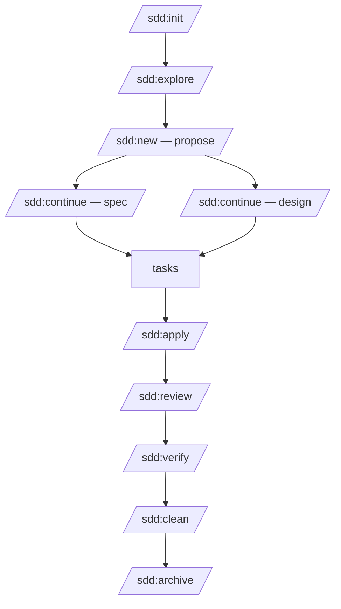

# The SDD Pipeline: 11 Language-Agnostic Phases from Idea to Archive

## Introduction

The SDD pipeline is an assembly line for AI-assisted code changes. Each phase has a dedicated sub-agent with a focused SKILL.md file, defined inputs (artifacts from prior phases), defined outputs (new artifacts for next phases), and rules that prevent scope creep and quality shortcuts.

The pipeline enforces a strict separation of concerns: no phase reads what it does not need, no agent writes what it is not responsible for, and no step can be skipped without explicit justification. Quality gates at review, verify, and archive phases prevent low-quality changes from reaching the codebase.

### Claude vs. Go: who does what

Not every phase uses Claude tokens. The `sdd` Go binary handles all deterministic work — state detection, context assembly, verify execution, and archive operations — at zero token cost. Claude sub-agents handle the reasoning work: exploration, proposal, spec, design, tasks, apply, and semantic review.

| Phase | Executor | Token cost |
|-------|----------|-----------|
| State detection (next phase?) | `sdd` binary | 0 |
| Context assembly for sub-agents | `sdd` binary | 0 |
| explore | Claude sub-agent (Sonnet) | tokens |
| propose | Claude sub-agent (Sonnet) | tokens |
| spec + design | Claude sub-agents (Sonnet / Opus) | tokens |
| tasks | Claude sub-agent (Sonnet) | tokens |
| apply | Claude sub-agent (Opus) | tokens |
| review | Claude sub-agent (Sonnet) | tokens |
| verify (run commands + parse results) | `sdd` binary | 0 |
| clean | Claude sub-agent (Sonnet) | tokens |
| archive (file ops + spec merge) | `sdd` binary | 0 |

The orchestrator (Claude Code) never reads source code directly. It delegates all investigation, design, and implementation work to sub-agents launched via the Task tool. The `sdd` binary handles pipeline state, context caching, and gate enforcement. The orchestrator's only jobs are presenting summaries to the user, asking for approval, and launching the next sub-agent in the pipeline.

This architecture means that at any point in the pipeline, the orchestrator's context contains only artifact paths and phase state — not hundreds of lines of source code. Sub-agents receive a narrow, relevant slice of context: the specific artifacts they need, the specific skill file for their domain, and no more.

### Context assembly and caching

Before launching any sub-agent, `sdd` assembles its context from the pipeline state. The assembly is cached by content-hash + TTL: if the same set of artifacts is requested twice (e.g., when apply retries after a build failure), the cache is served without re-reading files. This prevents redundant I/O and keeps token budgets predictable.

The assembled context includes a **Context Cascade** — a cumulative decision log that carries every architectural decision made in prior phases forward into subsequent phases. Sub-agents see: their own artifacts, the Context Cascade, and nothing else.

---

## Pipeline Overview

### Flowchart



Note that spec and design are parallel branches that both depend on proposal.md and both feed into tasks. All other phases are sequential.

### Artifact Flow Table

| Phase   | Command          | Input                              | Output Artifact                              |
|---------|------------------|------------------------------------|----------------------------------------------|
| init    | /sdd:init        | Project root                       | openspec/config.yaml                         |
| explore | /sdd:explore     | config.yaml, topic                 | exploration.md                               |
| propose | /sdd:new         | exploration.md                     | proposal.md                                  |
| spec    | /sdd:continue    | proposal.md                        | specs/*/spec.md                              |
| design  | /sdd:continue    | proposal.md                        | design.md                                    |
| tasks   | /sdd:continue    | spec + design                      | tasks.md                                     |
| apply   | /sdd:apply       | tasks + design + specs             | source code, updated tasks.md                |
| review  | /sdd:review      | source code, specs, design, conventions | review-report.md                          |
| verify  | /sdd:verify      | source code, tasks, specs          | verify-report.md                             |
| clean   | /sdd:clean       | source code, verify-report         | clean-report.md                              |
| archive | /sdd:archive     | all artifacts, verify-report       | archived change, updated openspec/specs/     |

---

## Phase-by-Phase Walkthrough

### Phase 1: init

**Executor**: `sdd` binary (Go) — zero token cost

**Purpose**: Bootstrap SDD for a project — detect stack, create the `openspec/` directory, and generate `config.yaml`.

**What the binary does**:
- Scans manifest files, lockfiles, and config files to auto-detect the tech stack
- Detects language, runtime, package manager, and framework(s) in use
- Identifies database technology and ORM if present
- Extracts project conventions from `CLAUDE.md` if it exists
- Creates the `openspec/` directory tree: `openspec/`, `openspec/specs/`, `openspec/changes/`, `openspec/changes/archive/`
- Writes `config.yaml` with all detected information

**Key rules**:
- Never modifies any existing project file. Only creates the `openspec/` directory and its contents.
- If `openspec/config.yaml` already exists, reports current configuration state and exits without overwriting.
- Stack detection is best-effort; unrecognized stacks are recorded as `unknown` with a warning for manual completion.

**Output artifact**: `openspec/config.yaml`

**v1.1 Enhancements**: **PARCER Operational Contracts** — config.yaml now includes a `contracts` section with formal pre/post-conditions for every phase, validated by the `sdd` binary before launching sub-agents.

**Example config.yaml** (auto-detected for a TypeScript/Bun project — values vary by stack):
```yaml
project:
  name: my-saas-app
  root: /Users/dev/projects/my-saas-app

stack:
  language: typescript
  runtime: bun

commands:
  typecheck: bun run typecheck
  lint: bun run lint
  test: bun test
  format_check: bun run format:check

conventions:
  # Mapped from CLAUDE.md if present
```

---

### Phase 2: explore

**Executor**: Claude sub-agent (Sonnet) — reads codebase, produces structured report

**Purpose**: Read-only codebase investigation with risk assessment before any changes are proposed.

**What the sub-agent does**:
- Maps relevant files using Glob patterns based on the topic provided
- Greps for related types, function names, imports, and exports to build a dependency map
- Reads files to understand existing patterns: naming conventions, error handling style, data flow
- Builds a dependency map showing both direct dependencies (files that import the target) and transitive dependencies (files that import the importers)
- Produces an 8-dimension risk assessment:
  1. **Blast radius** — how many files does a change here affect?
  2. **Type safety** — how deeply typed is the affected surface?
  3. **Test coverage** — are the affected paths tested?
  4. **Coupling** — how tightly are affected modules coupled?
  5. **Complexity** — cyclomatic complexity of affected functions
  6. **Data integrity** — does this touch database schemas or migrations?
  7. **Breaking changes** — does this affect public APIs or exported types?
  8. **Security surface** — does this touch auth, input validation, or data exposure?
- Compares multiple implementation approaches: their tradeoffs, complexity, and alignment with existing patterns

**Context assembled by `sdd`**: config.yaml + the specific files matching the topic. The Context Cascade (prior decisions) is prepended so the sub-agent is aware of established patterns without the orchestrator summarizing them.

**Three detail levels**:
- **Concise** (30–50 lines): Used for small, well-understood topics. Covers affected files, key types, and a brief risk summary.
- **Standard** (80–150 lines): Default level. Covers all 8 risk dimensions, dependency map, and 2–3 implementation approaches.
- **Deep** (150–300 lines): Used for high-risk or poorly understood topics. Full dependency trees, all edge cases, multiple approaches with code sketches.

**Key rules**:
- Strictly read-only. No file creation, no file modification.
- Never proposes a solution in exploration.md — that is the job of sdd-propose.
- Must document assumptions explicitly when files cannot be fully analyzed (e.g., generated code, external packages).

**Output artifact**: `openspec/changes/{name}/exploration.md`

**v1.1 Enhancement — Structured Exploration Protocol**: The explore agent now follows a mandatory hypothesis-driven cycle for each file read: HYPOTHESIS (what it expects to find) → CONFIDENCE level (HIGH/MEDIUM/LOW) → OBSERVATIONS (findings with File:Line references) → HYPOTHESIS STATUS (CONFIRMED/REFUTED/REFINED) → NEXT ACTION JUSTIFICATION. This prevents shallow, aimless file reading and creates an auditable reasoning trail.

**Example exploration.md excerpt**:
```markdown
## Risk Assessment

| Dimension        | Level  | Notes                                              |
|------------------|--------|----------------------------------------------------|
| Blast radius     | HIGH   | 23 files import from src/auth/                     |
| Type safety      | MEDIUM | AuthUser type is well-typed; session tokens use any |
| Test coverage    | LOW    | src/auth/ has 34% coverage                         |
| Coupling         | HIGH   | Auth logic is mixed into 4 different services      |
| Complexity       | MEDIUM | refreshToken() has cyclomatic complexity of 12     |
| Data integrity   | HIGH   | Changes affect users and sessions tables           |
| Breaking changes | HIGH   | AuthUser is exported and used in 18 components     |
| Security surface | CRITICAL | This is the authentication boundary              |

## Implementation Approaches

### Approach A: Extend existing AuthUser type
- Pros: minimal change surface, backward-compatible
- Cons: the existing type has any in session field, would inherit the problem

### Approach B: New AuthenticatedUser branded type
- Pros: type-safe from the ground up, enables discriminated unions
- Cons: requires updating 18 call sites
```

---

### Phase 3: propose

**Executor**: Claude sub-agent (Sonnet) — reasoning over exploration output

**Purpose**: Write a human-readable change proposal capturing WHAT and WHY before any technical decisions are made.

**Required sections in proposal.md**:
1. **Intent** — one paragraph describing the goal in plain language
2. **Scope (in)** — explicit list of what this change covers
3. **Scope (out)** — explicit list of what this change does NOT cover (prevents scope creep)
4. **Approach** — high-level description of the chosen solution
5. **Key Decisions** — architectural choices made at proposal time and the rationale for each
6. **Affected Areas** — files, modules, or domains likely to be touched
7. **Risks** — top risks identified in exploration, with mitigations
8. **Rollback Plan** — how to revert this change if it causes problems in production
9. **Dependencies** — other changes or external systems this depends on
10. **Success Criteria** — measurable conditions that define "done"
11. **Open Questions** — unresolved questions that must be answered before or during implementation

**Context assembled by `sdd`**: exploration.md + Context Cascade (prior architectural decisions).

**Key rules**:
- Rollback Plan is NEVER optional. Every change, no matter how small, must have one.
- Success criteria must be measurable. "Works correctly" is not acceptable. Acceptable examples: "typecheck passes with zero errors", "all 47 auth-related tests pass", "login endpoint returns 401 with correct error shape for invalid credentials".
- Changes touching 10 or more files receive a size warning recommending the change be split into smaller, independently deployable changes.
- Open Questions must be resolved (or explicitly deferred with justification) before tasks.md is written.

**Output artifact**: `openspec/changes/{name}/proposal.md`

**Example rollback plan**:
```markdown
## Rollback Plan

1. Revert the git commit range: `git revert HEAD~3..HEAD`
2. The users table migration adds a nullable column — it is safe to leave in place
   (no data loss, existing queries still work)
3. If the migration is also reverted: `bun run db:migrate:down --to 20260220`
4. Session tokens issued during the new flow will be invalidated on revert;
   affected users will be asked to log in again
5. No infrastructure changes were made; no deployment rollback needed
```

---

### Phase 4 + 5: spec + design (Parallel)

Both phases depend only on `proposal.md`. They run simultaneously, making the planning stage faster for larger changes. Neither phase reads source code — they work from the proposal and (optionally) the exploration report.

`sdd` launches both sub-agents concurrently after assembling their respective context slices. The orchestrator waits for both to complete before proceeding to tasks.

---

#### Phase 4: spec

**Executor**: Claude sub-agent (Sonnet) — template-driven RFC 2119 output

**Purpose**: Define WHAT the system must do — behavioral requirements without implementation details.

**What the sub-agent does**:
- Writes delta specs using three markers: ADDED (new requirements), MODIFIED (changed requirements), REMOVED (deleted requirements)
- Uses RFC 2119 keywords consistently:
  - **MUST / SHALL** — absolute requirement, no exceptions
  - **SHOULD** — recommended, can be skipped with justification
  - **MAY** — optional, implementer's discretion
- Writes Given/When/Then scenarios for every MUST requirement
- Scenarios use concrete, specific values: exact HTTP status codes, exact error message shapes, specific input values — never vague descriptions like "returns an error"
- Groups requirements by domain (e.g., `specs/auth/spec.md`, `specs/billing/spec.md`)

**Context assembled by `sdd`**: proposal.md + Context Cascade.

**Key rules**:
- Specs describe behavior, not implementation. "The system MUST return 401" is correct. "The system MUST use JWT middleware" is design, not spec.
- Every MUST requirement must have at least one Given/When/Then scenario.
- Scenarios must be independently testable — not dependent on other scenarios' state.

**Output artifact**: `openspec/changes/{name}/specs/*/spec.md`

**Example spec excerpt**:
```markdown
## REQ-AUTH-001 [ADDED]
The login endpoint MUST return a 401 Unauthorized response when credentials are invalid.

### Scenario: Invalid password
Given a registered user with email "user@example.com"
When a POST /auth/login request is made with body:
  { "email": "user@example.com", "password": "wrong-password" }
Then the response status MUST be 401
And the response body MUST match:
  { "error": "INVALID_CREDENTIALS", "message": "Email or password is incorrect" }
And no session token SHOULD be set in the response headers or cookies

## REQ-AUTH-002 [ADDED]
The login endpoint MUST NOT reveal which field (email or password) caused the failure.

### Scenario: Nonexistent email
Given no user exists with email "ghost@example.com"
When a POST /auth/login request is made with body:
  { "email": "ghost@example.com", "password": "any-password" }
Then the response body MUST be identical to REQ-AUTH-001 scenario response
  (timing attacks are out of scope for this change — see REQ-AUTH-007)
```

---

#### Phase 5: design

**Executor**: Claude sub-agent (Opus) — architecture decisions, interfaces, file changes

**Purpose**: Define HOW the system will implement the spec — architecture, interfaces, file changes.

**What the sub-agent does**:
- Documents architecture decisions with alternatives that were considered and rejected
- Draws ASCII data flow diagrams showing the path through the system for key scenarios
- Writes type/interface definitions in the project's language — actual compilable types, not pseudocode
- Produces a file changes table listing every file that will be created, modified, or deleted, with absolute paths
- Maps each design decision back to spec requirements (REQ-AUTH-001 → LoginService.authenticate())
- Writes a testing strategy: which test types (unit, integration, E2E) cover which spec requirements

**Context assembled by `sdd`**: proposal.md + spec artifacts + Context Cascade. Opus is used here because architecture decisions compound through every subsequent phase — wrong decisions here have the largest downstream cost.

**Key rules**:
- Interface/type definitions must be valid in the project's language. They will be copy-pasted into implementation.
- The file changes table must be exhaustive. Files not in the table should not be modified during apply.
- Design decisions must reference the spec requirement they satisfy.

**Output artifact**: `openspec/changes/{name}/design.md`

**Example design excerpt**:
```markdown
## Data Flow: Login Request

```
Client
  │ POST /auth/login { email, password }
  ▼
LoginRoute (src/routes/auth/login.route.ts)
  │ validates with LoginSchema (Zod)
  │ on parse error → 400 { error: "VALIDATION_ERROR" }
  ▼
AuthService.login(email, password) → Result<SessionToken, AuthError>
  │ UserRepository.findByEmail(email) → Result<User | null, DbError>
  │ if null → Err({ code: "INVALID_CREDENTIALS" })
  │ PasswordService.verify(password, user.passwordHash) → boolean
  │ if false → Err({ code: "INVALID_CREDENTIALS" })
  │ SessionRepository.create(userId) → Result<SessionToken, DbError>
  ▼
LoginRoute
  │ on Ok → 200 { token, expiresAt }
  │ on Err("INVALID_CREDENTIALS") → 401 { error: "INVALID_CREDENTIALS", message: ... }
  │ on Err(other) → 500 { error: "INTERNAL_ERROR" }
```

## TypeScript Interfaces

```typescript
interface LoginRequest {
  readonly email: string;
  readonly password: string;
}

type AuthError =
  | { readonly code: "INVALID_CREDENTIALS" }
  | { readonly code: "ACCOUNT_LOCKED"; readonly lockedUntil: Date }
  | { readonly code: "INTERNAL_ERROR"; readonly cause: unknown };

interface SessionToken {
  readonly token: string;
  readonly userId: UserId;
  readonly expiresAt: Date;
}
```

## File Changes Table

| File | Action | Description |
|------|--------|-------------|
| src/routes/auth/login.route.ts | CREATE | Login endpoint, Zod validation |
| src/services/auth.service.ts | MODIFY | Add login() method |
| src/repositories/session.repository.ts | CREATE | Session CRUD |
| src/schemas/auth.schema.ts | CREATE | LoginSchema (Zod) |
| src/routes/auth/login.route.test.ts | CREATE | Integration tests |
| src/services/auth.service.test.ts | MODIFY | Add login() unit tests |
```

---

### Phase 6: tasks

**Executor**: Claude sub-agent (Sonnet) — converting design into a numbered checklist

**Purpose**: Break spec + design into a phased, numbered implementation checklist that can be executed in order.

**What the sub-agent does**:
- Reads both `spec.md` and `design.md` from the current change
- Organizes work into numbered phases using **bottom-up ordering** — as many or as few as the change requires (a 2-file bugfix might need 2 phases; a full-stack feature might need 6). Phase 1 contains the lowest-level work (types, schemas, config); each subsequent phase builds on the previous.
- Numbers every task: `1.1`, `1.2`, `2.1`, etc.
- Marks tasks that can be done in parallel within a phase
- Produces a requirement traceability matrix: each requirement mapped to the tasks that implement it and the tests that verify it

**Context assembled by `sdd`**: spec artifacts + design.md + Context Cascade.

**Task format**:
```
- [ ] 2.1 Create — /abs/path/to/file.ts, implement AuthService.login() following Result<T,E> pattern
- [ ] 2.2 Create — /abs/path/to/session.repository.ts, implement SessionRepository.create()
- [ ] 2.3 Modify — /abs/path/to/auth.service.ts, add login() to existing AuthService class
```

**Key rules**:
- Every task references an absolute file path. No ambiguous descriptions.
- Phases follow strict bottom-up ordering — no task may reference a file created in a later phase.
- Testing tasks must reference the spec scenarios they verify (e.g., "covers REQ-AUTH-001 scenario: Invalid password").

**Output artifact**: `openspec/changes/{name}/tasks.md`

**Example traceability matrix**:
```markdown
## Requirement Traceability Matrix

| Requirement    | Implementing Tasks | Verifying Tests |
|----------------|--------------------|-----------------|
| REQ-AUTH-001   | 2.1, 3.1           | 4.1, 4.2        |
| REQ-AUTH-002   | 2.1                | 4.3             |
| REQ-AUTH-003   | 1.2, 2.2, 3.1      | 4.4, 4.5        |
```

---

### Phase 7: apply

**Executor**: Claude sub-agent (Opus) — production code, highest cognitive load

**Purpose**: Implement code following specs and design, in batches, with a build-fix loop after each batch.

**What the sub-agent does**:
- Implements one task phase at a time, following the bottom-up order defined in tasks.md
- Before modifying any file: reads the existing file to understand its structure, naming patterns, and import style
- Uses spec scenarios as acceptance criteria: if implementing a function, the scenarios for that function are the definition of correct behavior
- Marks tasks `[x]` as completed in tasks.md immediately after implementing them
- Runs a build-fix loop after each batch using commands from config.yaml:
  1. Typecheck — fix type errors
  2. Lint — fix lint violations
  3. Test — fix failing tests
  4. Format check — fix formatting
  - Maximum 5 fix attempts per error before escalating to the user
- Supports `--tdd` flag: writes a failing test first, confirms it fails, then implements the code to make it pass
- Supports `--phase N` flag to run only a specific phase (e.g., `--phase 2` for Core only)
- Supports `--fix-only` flag to only run the build-fix loop without writing new code

**Context assembled by `sdd`**: tasks.md + design.md + spec artifacts + the specific file being modified (not the whole codebase) + Context Cascade. Opus is used here because writing production code that matches existing patterns and satisfies spec scenarios requires the deepest reasoning.

**Key rules**:
- Never suppresses type errors or compiler warnings. Follow the strictest settings available for the project's language.
- If the design contradicts the spec, follow the spec and note the deviation in a comment in tasks.md.
- Never modifies files not listed in the design's file changes table without explicit justification.
- If a build-fix loop exceeds 5 attempts for the same error, stop and report the issue rather than trying increasingly creative workarounds.

**Output artifacts**: Source code (created/modified per the file changes table) + updated `tasks.md` with completed tasks marked `[x]`

**v1.1 Enhancements**: Three additions strengthen the apply phase: (1) **Structured Reading Protocol** — before modifying any file, the agent completes a hypothesis cycle to ensure new code follows existing patterns. (2) **Test Generation Governance** — standard mode explicitly avoids generating speculative tests when specs provide sufficient coverage, conserving token budget. (3) **Experience-Driven Early Termination (EET)** — the build-fix loop queries Engram memory before fix attempt #3+; if the error signature matches a known dead-end from prior sessions, the loop aborts early instead of wasting tokens.

---

### Phase 8: review

**Executor**: Claude sub-agent (Sonnet) — checklist comparison against specs and AGENTS.md rules

**Purpose**: Semantic code review — does the implementation satisfy specs, design, and project rules? A separate agent reviews code it did not write, eliminating the circular "AI reviews its own work" problem.

**What the sub-agent checks**:

**Spec compliance**:
- Is every Given/When/Then scenario covered by the implementation?
- Do response shapes match exactly (status codes, error codes, field names)?
- Are MUST requirements unconditionally satisfied?
- Are SHOULD requirements either satisfied or explicitly justified?

**Design compliance**:
- Are module boundaries respected (no direct DB access outside repositories)?
- Do implemented interfaces match the type definitions in design.md?
- Does the data flow match the ASCII diagram in design.md?

**Convention rule enforcement**:
- **REJECT violations** — any match causes an immediate FAILED verdict. The review report lists the exact violation, the rule, and the file/line.
- **REQUIRE violations** — missing required elements cause a FAILED verdict.
- **PREFER violations** — noted as advisory items in the report, do not block the verdict.

**Pattern compliance**:
- Naming conventions (camelCase functions, PascalCase types, SCREAMING_SNAKE for constants)
- Error handling style (Result<T,E> pattern, no empty catch blocks)
- Import style (no barrel imports if the project bans them, etc.)

**Security quick scan** (OWASP Top 10 patterns):
- SQL injection: concatenated queries, parameterized query misuse
- XSS: innerHTML with dynamic content, unescaped user data in templates
- Auth bypass: missing authentication middleware on protected routes
- Hardcoded secrets: API keys, passwords, tokens in source code
- Insecure direct object reference: object ID accessed without ownership check

**Verdict levels**:
- `PASSED` — all REJECT and REQUIRE rules satisfied, all spec scenarios covered
- `FAILED` — one or more REJECT violations, or one or more REQUIRE violations, or spec scenarios uncovered

**Context assembled by `sdd`**: changed source files + spec artifacts + design.md + AGENTS.md + Context Cascade. The sub-agent does NOT receive the apply agent's conversation history or task progress — it evaluates the code cold.

**Output artifact**: `openspec/changes/{name}/review-report.md`

**v1.1 Enhancements**: Two additions: (1) **Dynamic Agentic Rubric** (Step 2b) — before reviewing code, the agent generates a change-specific rubric from specs, design.md, and project conventions, then scores each criterion post-review. This anchors evaluation to actual requirements. (2) **Semi-Formal Certificate** (Steps 3h–3j) — function tracing table, data flow analysis, and counter-hypothesis check force the agent to trace every function signature, map data flow with invariants, and actively search for evidence the implementation could fail.

**Example review-report.md excerpt**:
```markdown
## Verdict: FAILED

### REJECT Violations (blocking)

| Rule | Location | Violation |
|------|----------|-----------|
| Direct database access outside /src/data/ | src/routes/auth/login.route.ts:47 | `db.query()` called directly in route handler |

### Spec Coverage

| Requirement | Scenario | Status | Notes |
|-------------|----------|--------|-------|
| REQ-AUTH-001 | Invalid password | COVERED | src/services/auth.service.test.ts:34 |
| REQ-AUTH-002 | Nonexistent email | MISSING | No test for timing-safe comparison behavior |

### PREFER Advisory

- [ ] Consider branded type `UserId` instead of `string` for user.id (PREFER-003)
```

---

### Phase 9: verify

**Executor**: `sdd` binary (Go) — zero token cost

**Purpose**: Technical quality gate — confirms build health, static analysis, security hygiene, and completeness before the change can be cleaned and archived.

**What the binary runs**:

**Build checks** (commands sourced from config.yaml):
- Typecheck — zero type errors required
- Lint — zero lint violations required
- Format check — zero formatting violations required
- Test — all tests pass, no test failures

**Static analysis** (code-level pattern scan):
- Banned constructs as defined by the project's conventions and language strictness settings
- Each violation is reported with file path and line number

**Security scan**:
- Hardcoded secrets (regex patterns for common API key formats, passwords in strings)
- Injection risks (string-concatenated queries, dynamic code execution with untrusted input)
- Language-specific vulnerability patterns (XSS for web frontends, SQL injection for backends, etc.)
- Dependency audit using the project's package manager

**Completeness check**:
- Tasks completion percentage: `[x]` tasks / total tasks
- Spec scenarios with corresponding tests: covered scenarios / total MUST scenarios
- Design interfaces implemented: interfaces found in source / interfaces defined in design.md

This entire phase runs in Go. The binary executes the project's commands, captures stdout/stderr, parses exit codes, runs regex scans over the source files, and writes a structured verify-report.md. No Claude tokens are consumed.

**Three verdicts**:
- `PASS` — all checks pass, completeness ≥ 95%
- `PASS WITH WARNINGS` — all checks pass, but completeness is 80–94% or there are PREFER violations from review
- `FAIL` — any check fails, or completeness < 80%, or there are unresolved REJECT violations from review-report

**Output artifact**: `openspec/changes/{name}/verify-report.md`

**v1.1 Enhancement — Fault Localization Protocol** (Step 5b): When tests fail, the verify agent now produces structured PREMISES (step-by-step test semantics: arrange/act/assert) and DIVERGENCE CLAIMS (formal statements cross-referencing test expectations with specific source code locations where behavior diverges). This gives sdd-apply precise diagnosis instead of raw failure output. Note: fault localization analysis is the one sub-step in verify that may use a Claude sub-agent; the command execution and report writing are always Go-native.

**Example verify-report.md excerpt**:
```markdown
## Verdict: PASS WITH WARNINGS

### Build Health
- [x] typecheck: PASS (0 errors)
- [x] lint: PASS (0 violations)
- [x] format: PASS
- [x] tests: PASS (47 passed, 0 failed, 0 skipped)

### Static Analysis
- [x] No `any` usage found
- [x] No type assertions found
- [!] 1 non-null assertion found: src/services/auth.service.ts:89
      `user!.passwordHash` — flagged for review

### Completeness
- Tasks: 18/19 complete (94.7%) — task 5.2 marked incomplete
- Spec scenarios: 6/6 covered (100%)
- Design interfaces: 4/4 implemented (100%)
```

---

### Phase 10: clean

**Executor**: Claude sub-agent (Sonnet) — scoped dead code removal

**Purpose**: Remove dead code, eliminate duplicates, and simplify expressions — scoped only to the files touched by the current change.

**What the sub-agent does**:
- Removes unused imports and variables that were introduced or exposed by the change
- Removes unreachable code paths
- Consolidates duplicated logic following the Rule of Three: extract when 3+ occurrences exist, or when 2 occurrences are identical (not merely similar)
- Simplifies expressions:
  - `x !== null && x !== undefined ? x : defaultValue` → `x ?? defaultValue`
  - `arr.filter(fn).length > 0` → `arr.some(fn)`
  - Nested ternaries → early returns or switch expressions
- Verifies after each removal: the `sdd` binary runs typecheck and test commands after each cleanup to confirm nothing broke

**Scope boundaries** — clean is limited to:
- Files listed in the design's file changes table
- Direct dependents of those files (one hop)

**What clean will NOT touch**:
- Test fixtures (even if they look redundant — fixtures are intentional)
- Feature flags (dead code may be intentional for staged rollouts)
- Polyfills and compatibility shims
- Generated code (migrations, GraphQL types, OpenAPI clients)
- Public API surface (exported functions/types used by external consumers)

**Key rules**:
- Clean runs after verify has passed. The `sdd` binary enforces this gate: if verify-report verdict is FAIL, clean is blocked before the sub-agent is even launched.
- Every cleanup must be followed immediately by running typecheck and test commands to confirm no regressions.
- If a cleanup introduces a test failure, it is reverted rather than fixed.

**Output artifact**: `openspec/changes/{name}/clean-report.md`

**Example clean-report.md excerpt**:
```markdown
## Cleanup Summary

### Removed
- src/routes/auth/login.route.ts: 3 unused imports (uuid, Logger, AuthMiddleware)
- src/services/auth.service.ts: unreachable branch after early return at line 112

### Consolidated
- Extracted `formatAuthError(code: AuthErrorCode): string` to src/utils/auth.utils.ts
  (was duplicated in login.route.ts:67 and register.route.ts:89)

### Simplified
- src/services/auth.service.ts:45: nested ternary → early return pattern

### Skipped
- src/services/auth.service.test.ts: test fixtures left as-is (intentional duplication)

### Verification
- typecheck: PASS after each change
- tests: PASS after each change (47 passed)
```

---

### Phase 11: archive

**Executor**: `sdd` binary (Go) — zero token cost

**Purpose**: Close the change — merge delta specs into the main spec files, move the change directory to archive, and capture reusable learnings.

**What the binary does**:

**Safety gate** (checked before any file operation):
- Reads `verify-report.md` verdict. If FAIL, aborts immediately.
- Reads `review-report.md` for unresolved REJECT violations. If any remain, aborts.

**Spec merge**:
- ADDED requirements in `changes/{name}/specs/` are appended to the corresponding `openspec/specs/{domain}.spec.md`
- MODIFIED requirements: the old version is preserved as a comment (for audit trail), the new version replaces it
- REMOVED requirements: commented out in the main spec file — never deleted (preserves the history of why something was required and then removed)

**Archive**:
- Moves `openspec/changes/{name}/` to `openspec/changes/archive/{YYYY-MM-DD}-{name}/`
- Writes `archive-manifest.md` with: change summary, phase verdicts, key decisions, metrics (files changed, lines added/removed, tests added)

**Learnings extraction** (optional, Claude-assisted):
- Identifies reusable patterns from this change (e.g., "Result<T,E> with Zod validation pattern for route handlers")
- If a Claude sub-agent is invoked for this step, it reads only the archive-manifest.md — not the full artifact tree
- Saves patterns to `~/.claude/skills/learned/` as SKILL.md files for future sessions

The spec merge and file move operations are entirely Go. The binary performs atomic renames, writes structured YAML and Markdown, and updates content-hash records for the cache. Only the optional learnings extraction step may invoke Claude.

**Output artifacts**:
- `openspec/changes/archive/{date}-{name}/` — all phase artifacts preserved
- `openspec/changes/archive/{date}-{name}/archive-manifest.md` — change summary
- `openspec/specs/{domain}.spec.md` — updated with merged requirements
- `~/.claude/skills/learned/{pattern-name}.md` — optional reusable skills

**Example archive-manifest.md**:
```markdown
# Archive Manifest: add-login-endpoint

**Archived**: 2026-02-22
**Duration**: 3 sessions over 2 days

## Phase Verdicts
- explore: COMPLETED
- propose: APPROVED
- spec: COMPLETED
- design: COMPLETED
- tasks: COMPLETED (19/19 tasks)
- apply: COMPLETED
- review: PASSED (1 PREFER advisory noted)
- verify: PASS WITH WARNINGS (non-null assertion resolved in clean)
- clean: COMPLETED
- archive: COMPLETED

## Key Decisions
- Used Result<T,E> pattern for AuthService rather than throwing exceptions
- Chose timing-safe string comparison for password verification (see REQ-AUTH-007)
- Deferred rate limiting to future change (out of scope per proposal)

## Metrics
- Files created: 4
- Files modified: 2
- Lines added: 387
- Lines removed: 12
- Tests added: 22
- Spec requirements added: 7
```

---

## Shortcut: /sdd:continue

After each phase completes, run `/sdd:continue` (or `/sdd:continue {change-name}` if multiple active changes exist) to detect what phase is next and run it automatically.

State detection is performed by `sdd` — the binary reads the existing artifacts in `openspec/changes/{name}/` to determine current phase state:

```
openspec/changes/add-login-endpoint/
  exploration.md    ← exists → explore done
  proposal.md       ← exists → propose done
  specs/            ← exists → spec done
  design.md         ← exists → design done
  tasks.md          ← exists → tasks done, next: apply
```

When both spec and design are needed (the parallel branch), `/sdd:continue` launches both as simultaneous Task tool calls and waits for both to complete before proceeding to tasks.

If the orchestrator detects a failed phase (e.g., review-report.md with FAILED verdict), it reports the failure and asks for user instruction rather than blindly proceeding.

---

## Shortcut: /sdd:ff

Fast-forward all planning phases without stopping for user approval at each step:

```
/sdd:ff add-dark-mode Add dark mode toggle to settings page
```

This runs explore → propose → spec + design (parallel) → tasks all at once, producing a complete, ready-to-implement plan in a single command. The user reviews the final `tasks.md` and approves before any code is written.

The `sdd` binary manages the state transitions and context assembly between each planning phase. Claude sub-agents handle the reasoning at each step. Fast-forward is appropriate for well-understood changes or when you trust the SDD pipeline to make good decisions without intermediate review. For high-risk changes (touching auth, billing, data migrations), running phases individually and reviewing each output is recommended.

---

## The openspec/ Directory

All SDD artifacts live in `openspec/`, which is committed to the repository alongside source code. This makes the entire planning history versioned, reviewable, and auditable.

```
openspec/
  config.yaml                    # Project stack, conventions, paths
  specs/                         # Source of truth: merged, canonical specs
    auth.spec.md
    billing.spec.md
    user-management.spec.md
  changes/
    add-login-endpoint/          # Active change directory
      exploration.md
      proposal.md
      specs/
        auth/
          spec.md                # Delta spec (ADDED/MODIFIED/REMOVED)
      design.md
      tasks.md
      review-report.md
      verify-report.md
      clean-report.md
      quality-timeline.jsonl   # Phase delta tracking (one JSON line per phase)
    archive/
      2026-02-22-add-login-endpoint/   # Archived after sdd:archive
        archive-manifest.md
        exploration.md
        proposal.md
        specs/
        design.md
        tasks.md
        review-report.md
        verify-report.md
        clean-report.md
```

The `openspec/specs/` directory is the long-term record of what the system is supposed to do. Changes contribute to it over time via the archive merge step. `openspec/changes/` holds in-flight work. `openspec/changes/archive/` holds the history of all completed changes.

New team members can read `openspec/specs/` to understand the system's intended behavior without reading source code. Reviewers can audit `openspec/changes/archive/` to understand why decisions were made.

---

## Phase Delta Tracking

Every sub-agent returns a structured envelope to the orchestrator. After each return, the `sdd` binary extracts a `QualitySnapshot` and appends it as a single JSON line to `openspec/changes/{name}/quality-timeline.jsonl`. No Claude tokens are consumed for this bookkeeping.

### QualitySnapshot Fields

| Field | Source | Present in |
|-------|--------|-----------|
| `changeName` | Pipeline state | All phases |
| `phase` | Current phase name | All phases |
| `timestamp` | ISO 8601 | All phases |
| `agentStatus` | Envelope `status` field | All phases |
| `issues.critical` | Count of CRITICAL/REJECT/FAIL findings | review, verify |
| `buildHealth` | typecheck, lint, format, test pass/fail | apply, verify, clean |
| `completeness` | Task/spec completion counts | tasks, apply, verify |
| `scope` | Files created/modified/reviewed counts | apply, review, clean |
| `phaseSpecific` | Full envelope passthrough | All phases |

### Example Timeline Entry

```json
{"changeName":"add-csv-export","phase":"apply","timestamp":"2026-02-22T15:30:00Z","agentStatus":"COMPLETED","issues":{"critical":0},"buildHealth":{"typecheck":"PASS","lint":"PASS","tests":"PASS","format":"PASS"},"completeness":{"tasksTotal":19,"tasksComplete":12},"scope":{"filesCreated":3,"filesModified":2},"phaseSpecific":{"batch":2}}
```

### Design Principles

- **Observational, never blocking** — If envelope parsing fails, a minimal snapshot (`changeName`, `phase`, `timestamp`, `agentStatus`) is written and the pipeline continues.
- **Planning phases produce sparse snapshots** — explore/propose/spec/design/tasks populate only `agentStatus` and completion counts. All other fields are `null`. This is correct and expected.
- **One line per phase** — Each phase append produces exactly one JSON line. Multi-batch `sdd-apply` produces one line per batch with `phaseSpecific.batch` recording the batch number.
- **Analytics** — Run `/sdd:analytics {name}` to compute trends: build health progression, issue density by phase, completeness curves, and phase timing.

---

## Navigation

- Previous: [Why SDD?](./01-why-sdd.md)
- Next: [The Four Architecture Pillars](./03-pillars.md)
